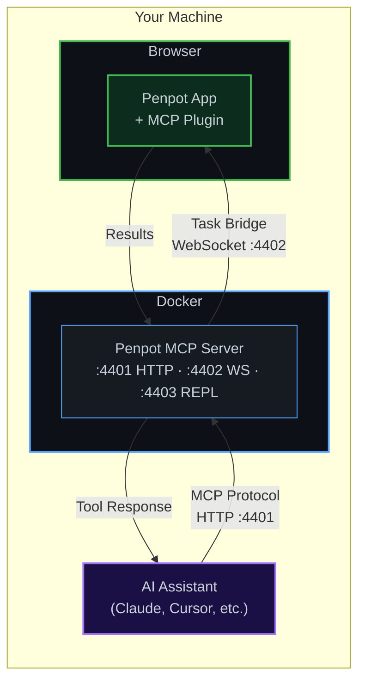

# Penpot MCP Server — Docker

Dockerized build of the official [Penpot MCP server](https://github.com/penpot/penpot/tree/develop/mcp) from the `penpot/penpot` repository.

This project clones, builds, and packages the MCP server into a minimal Docker image so you can run it with a single command — no local Node.js, pnpm, or monorepo checkout required.

## What It Does

The Penpot MCP server exposes [Model Context Protocol](https://modelcontextprotocol.io/) endpoints that let AI assistants (Claude, Cursor, etc.) interact with Penpot design files. It provides tools for:

- **`execute_code`** — Run Penpot Plugin API code in the browser context
- **`high_level_overview`** — Get a summary of the current Penpot project
- **`penpot_api_info`** — Query the Penpot Plugin API documentation
- **`export_shape`** — Export shapes/components as images
- **`import_image`** — Import images into Penpot projects

The server communicates with the Penpot desktop/web app via a WebSocket bridge (the Penpot MCP plugin must be installed in Penpot).

## How It Works



**Flow:**
1. You open **Penpot** in your browser with the **MCP Plugin** installed
2. The plugin connects to the Docker container via **WebSocket** (port 4402)
3. Your **AI assistant** connects to the container via **HTTP** (port 4401)
4. When the AI needs to interact with your design, it sends an MCP request → the server forwards it to the plugin → the plugin executes in Penpot and returns the result

## Ports

| Port | Protocol | Purpose |
|------|----------|---------|
| 4401 | HTTP/SSE | MCP client connections (`/mcp` streamable HTTP, `/sse` legacy) |
| 4402 | WebSocket | Penpot plugin bridge |
| 4403 | TCP/HTTP | REPL interface for debugging |

## Quick Start

```bash
# Clone this repo
git clone https://github.com/sebathi/penpot-mcp-docker.git
cd penpot-mcp-docker

# Copy env defaults
cp .env.example .env

# Build and run
docker compose up -d

# Verify
docker logs penpot-mcp-server
```

The server will be available at `http://localhost:4401/mcp`.

## Available Tags

Docker images are tagged to match Penpot release versions. MCP support was introduced in Penpot **2.13.1**.

| Tag | Penpot Version | Notes |
|-----|---------------|-------|
| `latest`, `2`, `2.13`, `2.13.3` | 2.13.3 | Current stable release |
| `2.13.2` | 2.13.2 | |
| `2.13.1` | 2.13.1 | First release with MCP |
| `develop` | develop branch | Bleeding edge, may break |

```bash
# Latest stable
docker pull sebathi/penpot-mcp-docker:latest

# Specific Penpot version
docker pull sebathi/penpot-mcp-docker:2.13.3

# Development branch
docker pull sebathi/penpot-mcp-docker:develop
```

## Configuration

All configuration is via environment variables. Copy `.env.example` to `.env` and adjust as needed.

### Server Binding

| Variable | Default | Description |
|----------|---------|-------------|
| `PENPOT_MCP_SERVER_LISTEN_ADDRESS` | `0.0.0.0` | Address the server binds to |
| `PENPOT_MCP_SERVER_ADDRESS` | `localhost` | Hostname clients use to reach the server |
| `PENPOT_MCP_SERVER_PORT` | `4401` | HTTP/SSE port |
| `PENPOT_MCP_WEBSOCKET_PORT` | `4402` | WebSocket port for plugin bridge |
| `PENPOT_MCP_REPL_PORT` | `4403` | REPL debugging port |

### Logging

| Variable | Default | Description |
|----------|---------|-------------|
| `PENPOT_MCP_LOG_LEVEL` | `info` | Log level: `trace`, `debug`, `info`, `warn`, `error`, `fatal` |
| `PENPOT_MCP_LOG_DIR` | `/app/logs` | Directory for log files (mapped to a Docker volume) |

### Runtime Modes

| Variable | Default | Description |
|----------|---------|-------------|
| `PENPOT_MCP_REMOTE_MODE` | `false` | Disable local filesystem access |
| `MULTI_USER` | `false` | Enable multi-user mode (also enables remote mode) |

### Build-Time

| Variable | Default | Description |
|----------|---------|-------------|
| `PENPOT_VERSION` | `develop` | Penpot release tag (`2.13.3`) or branch (`develop`, `mcp-prod`) |

## Building a Specific Penpot Version

```bash
# Build from a release tag
PENPOT_VERSION=2.13.3 docker compose build

# Build from a branch
PENPOT_VERSION=develop docker compose build
```

Or set `PENPOT_VERSION` in your `.env` file before building.

## Multi-User Mode

Multi-user mode allows multiple clients to connect simultaneously, each with their own session. It also enables remote mode automatically.

```bash
MULTI_USER=true docker compose up -d
```

## MCP Client Configuration

> **Note on transport:** Some MCP servers (like Gitea) use **stdio transport**, which lets you
> inline `"command": "docker"` directly in your MCP config. The Penpot MCP server uses
> **HTTP transport** instead, so the container needs to be running first and clients connect
> via URL.

### Step 1 — Start the server

Pick one of the options below. The server only needs to be started once — it stays running in the background.

**From Docker Hub (easiest):**

```bash
docker run -d \
  --name penpot-mcp-server \
  -p 4401:4401 \
  -p 4402:4402 \
  -p 4403:4403 \
  --restart unless-stopped \
  sebathi/penpot-mcp-docker:latest
```

**From source (for customization):**

```bash
git clone https://github.com/sebathi/penpot-mcp-docker.git
cd penpot-mcp-docker
cp .env.example .env
docker compose up -d
```

### Step 2 — Configure your MCP client

**Claude Desktop** — add to `~/Library/Application Support/Claude/claude_desktop_config.json` (macOS) or `%APPDATA%\Claude\claude_desktop_config.json` (Windows):

```json
{
  "mcpServers": {
    "penpot": {
      "url": "http://localhost:4401/mcp"
    }
  }
}
```

**Claude Code:**

```bash
claude mcp add penpot --transport http http://localhost:4401/mcp
```

**Cursor** — add to `.cursor/mcp.json`:

```json
{
  "mcpServers": {
    "penpot": {
      "url": "http://localhost:4401/mcp"
    }
  }
}
```

### Legacy SSE clients

For clients that don't support Streamable HTTP, use the SSE endpoint instead:

```json
{
  "mcpServers": {
    "penpot": {
      "url": "http://localhost:4401/sse"
    }
  }
}
```

## Architecture

The Docker image is built in two stages:

1. **Builder** (`node:22-slim`) — Sparse-clones only the `mcp/` directory from `penpot/penpot`, installs dependencies via pnpm, builds the TypeScript common library and esbuild-bundled server, then assembles a flat production dist.

2. **Runtime** (`node:22-slim`) — Installs only `dumb-init` for proper signal handling, copies the flat dist, installs production dependencies (including platform-specific `sharp` binaries), and runs as a non-root `penpot` user (UID 1001).

## Health Check

The container includes a built-in health check that verifies the HTTP server is responding:

```bash
docker inspect --format='{{.State.Health.Status}}' penpot-mcp-server
```

## Logs

Logs are written to a named Docker volume (`penpot-mcp-logs`) and also streamed to stdout:

```bash
# Live logs
docker logs -f penpot-mcp-server

# Log files on the volume
docker run --rm -v penpot-mcp_penpot-mcp-logs:/logs alpine ls /logs
```

## License

This project packages the official Penpot MCP server. Penpot is licensed under the [MPL-2.0](https://github.com/penpot/penpot/blob/develop/LICENSE).
